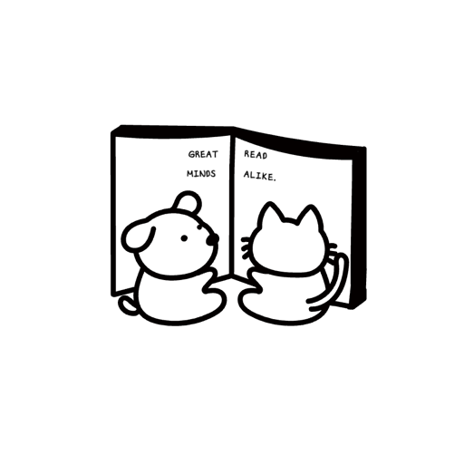

  
# 📚 WEbook - 당신 손 안의 작은 서점

 

당신 손 안의 작은 서점, WEbook

## 📖 목차

- [🏠 홈페이지](#-홈페이지)
- [🎯 프로젝트 소개](#-프로젝트-소개)
- [📌 기능 구성도](#-기능-구성도)
- [📌 API 명세서](#-api-명세서)
- [💻 코드](#-코드)
- [📱 App 설치](#-app-설치)
- [🎬 시연 동영상](#-시연-동영상)
- [🏆 작년 우수팀과의 비교표](#-작년-우수팀과의-비교표)

## 🎯 프로젝트 소개

사용자가 언제 어디서나 원하는 책을 쉽고 빠르게 찾고, 즐길 수 있도록 하는 **인터넷 서점 플랫폼**입니다.

---

### 🚀 핵심 기능

#### ❗️ 찾는 책이 있다면?   -> **검색기록, 추천 검색, 고급 검색**을 활용한 **효율적인 검색 제공**

#### ❓ 찾는 책이 없다면?   -> **장르 필터, 댓글, 별점, 다양한 정렬** 기능으로 **새로운 책을 편리하게 탐색**

####  ✅ 언제나, 어디서나!        ->  **Android, iOS, 데스크탑** 모두에서 사용 가능 – 크로스플랫폼 지원 완비

## 🏠 홈페이지
AWS: https://webook.kro.kr   
Azure: https://webook-azure.kro.kr  
GCP cloud: https://webook-gcp.kro.kr

## 📌 기능 구성도

  
기능구성도 보기 

## 📌 API 명세서

  
API 명세서 보기

## 💻 코드

[🔗 안드로이드](https://github.com/semperremformanda/bibliology/tree/main)  
[🔗 아이폰](https://github.com/mangozzzy/bookstore_flutter)  
[🔗 백엔드](https://github.com/swim0/HSuniv_Capstone_25)  
[🔗 리액트]()  

## 📱 App 설치
[🔗 안드로이드](https://play.google.com/store/apps/details?id=com.webook.app)  
[🔗 아이폰](https://testflight.apple.com/join/prHh2QEZ) 

## 🎬 시연 동영상
[🔗 안드로이드 시연 영상](https://youtu.be/R_Eo7Y2SqcI)  
[🔗 아이폰 시연 영상](https://www.youtube.com/watch?v=cZRThl8dmvQ)  
[🔗 백엔드 시연 영상](https://youtu.be/SktT7EE-AcM)  
[🔗 리액트](https://youtu.be/tx1E9k_2zDc)  

## 🏆 작년 우수팀과의 비교표

| 항목                   | WEbook | 최우수 | 우수1 | 우수2 | 우수3 |
|------------------------|--------|--------|-------|-------|-------|
| Code                   | ✅     | ✅     | ✅    | ✅    | ✅    |
| Doc            | ✅     | ✅     | ✅    | ❌    | ✅    |
| 영상                   | ✅     | ✅     | ❌    | ❌    | ❌    |
| 화면                   | I, A, R | R      | R     | R     | R     |
| AppStore/GooglePlay | ✅     | ❌     | ❌    | ❌    | ❌    |

최우수 : https://github.com/capstone-aloha 
우수1 : https://github.com/TeamCookCaps 
우수2 : https://github.com/godi00/capstone 
우수3 : https://github.com/Capic2024/server-flask
